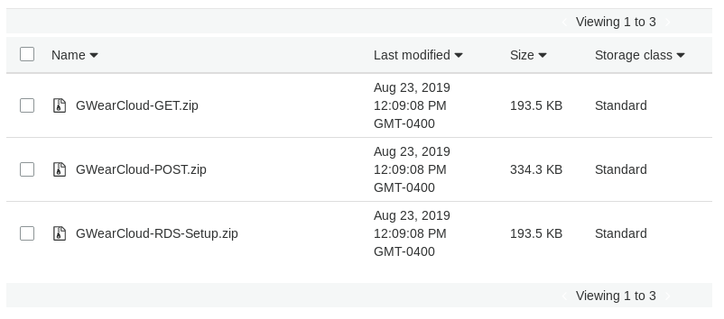
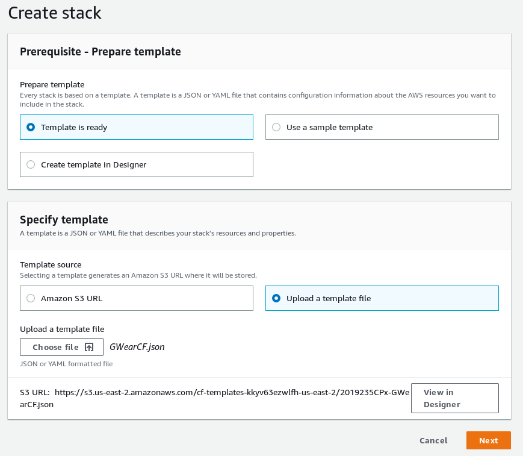
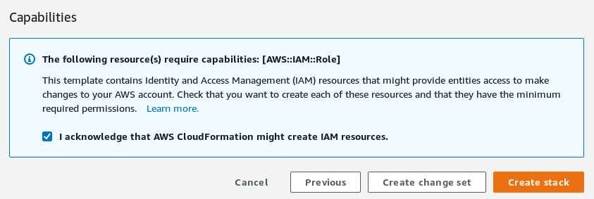

Installation
============

The following installation guide is meant to install the full GWearCloud stack. The two main components of the GWear system, the REST API and the data visualisation, is set up on AWS using the following steps. Note that all resources can be set up with the AWS Free Tier.

Prerequisites
-------------
This user manual assumes the following:

* The implementer has a valid AWS account
* The implementer has prior knowledge of Android app development

Download Files
--------------
The following files should be downloaded from https://github.com/gwulilab/GWearCloud/releases.

- GWearCloud-GET.zip
- GWearCloud-POST.zip
- GWearCloud-RDS-Setup.zip
- GWearCF.json

S3 Bucket Setup
---------------
For the CloudFormation template to work, there needs to be a valid S3 bucket to pull the Lambda deployment package from. If you are deploying your system on us-east-1 (N. Virginia), then the template already is linking to a valid S3 bucket. If you are deploying to any other region, the following instructions can be used to set up the bucket.

Creating the Bucket
~~~~~~~~~~~~~~~~~~~
Navigate to Amazon S3 and click “Create bucket”: https://s3.console.aws.amazon.com/s3

Type in a bucket name and remember it for the next step. Choose the same region as the one you will be deploying GWearCloud. Then click “Next”.

Leave all “Configure options” settings default. Click “Next”.

Uncheck “Block all public access”. Click “Next”.

Review all of your settings and click “Create bucket”.

Adding the Deployables
~~~~~~~~~~~~~~~~~~~~~~
Click “Upload”.

In the next window, add all zip files to the upload. Then click “Next” (do NOT click "Upload").

Under “Manage public permissions” select “Grant public read access to this object(s)”. Click “Upload”.

If everything was done correctly, you should see a screen similar to below.

CloudFormation
--------------
Navigate to https://console.aws.amazon.com/cloudformation/ to access the CloudFormation console.

Click on “Create stack”.

Select “Template is ready”.

Under "Specify template", choose "Upload a template file" and browse for the GWearCF.json template file. Then click “Next”.

Enter your desired stack name for your REST API under "Stack name" (such as "gwearcloud"). Then fill out the parameters for your stack. The most important to fill out is the “S3BucketNameParam” if you had to create a new bucket for your region. Then click “Next”.

Edit the stack settings as desired. Then click “Next”. The default settings are fine for most cases.

The final window summarises the stack you are about to create. If you are satisfied with every setting, check that you "acknowledge that AWS CloudFormation might create IAM resources", then click “Create stack”. 

The average spin up time should be between 10-20 minutes (depending on customisations, internet speeds, etc). The system is done generating when the stack status is changed to "Create_Complete".

Outputs
~~~~~~~
The following outputs will be found in the "Outputs" tab:

1. grafanaUrl - The URl to use for navigating to the data visualisation website
2. postgreslUrl - The URL to use to connect Grafana to the cloud database
3. restApiUrl - The URL to use when interfacing between an IoT gateway device and the GWearCloud system

PostgreSQL Setup
----------------
Currently, the generated database instance does not automatically create a database table or schema. CloudFormation will create a Lambda function called "RDS-Setup" that can be invoked to create the database table. The following steps should be taken to do that:

1. Navigate to https://console.aws.amazon.com/lambda
2. Click the function that includes "RdsSetup" in the name
3. Click "Test"
4. The default test setup is fine. Give it an event name (such as "test") and click "Create"
5. Click "Test"

If you see "Execution result: succeeded", then your database is now fully functional for the GWearCloud system.

Data Visualisation (Grafana) Setup
----------------------------------
The CloudFormation template will automatically create a Grafana web app instance. However, Grafana will still need to be configured from its web interface.

Instructions on gettings started with Grafana can be found at https://grafana.com/docs/guides/getting_started/

Instructions for connecting your PostgreSQL database to Grafana can be found at https://grafana.com/docs/features/datasources/postgres/

Troubleshooting
---------------
The following are possible issues that can arise.

Availability zones not accessible
~~~~~~~~~~~~~~~~~~~~~~~~~~~~~~~~~
The current CloudFormation template is only able to be deployed in regions that have 3 or more EC2 availability zones. To find out if your region is compatible, look at https://aws.amazon.com/about-aws/global-infrastructure/regions_az/

If you region does not have at least 3 availability zones, you should install in a different region that is compatible.

